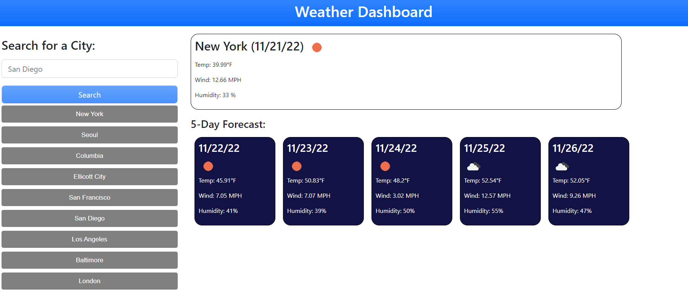

# city-weather-search-app-wk

## Description

This is a weather forecast application, which displays the current weather conditions and 5-day forecast for any city. I created this project to showcase my ability to understand API's.

The hardest part of this project was staying organized. I started by writing multiple .then statements within the same function. That quickly became confusing and hard to keep track of. Once I understood how to call a separate function within a .then statement,  I re-organized my entire project to improve the readability of the code.

Another challenge was getting the 5-day forecase to display dynamically. I ended up pushing all the value I needed to arrays, then rendering the values of the arrays to the screen one by one.

This project was my first real experience with server side API's. Keeping the code organized, writing multiple functions and calling them within a .then statement from the beginning would have made this project much easier, but I'm happy with the result!

Enjoy!

## Installation

 * To deploy application, go to [My Github Project](https://wiilki.github.io/city-weather-search-app-wk/)

## Usage

 * Enter name of city then click 'Search' to view weather
 * Your past searches will appear below the search bar
 * The page will display up to your last 10 searches
 * Click on previously searched city to view weather again

## Credits

* [Jquery](https://code.jquery.com/jquery-3.5.1.min.js)
* [Bootstrap](https://cdn.jsdelivr.net/npm/bootstrap@5.2.2/dist/css/bootstrap.min.css)
* [OpenWeatherMap](https://openweathermap.org/)